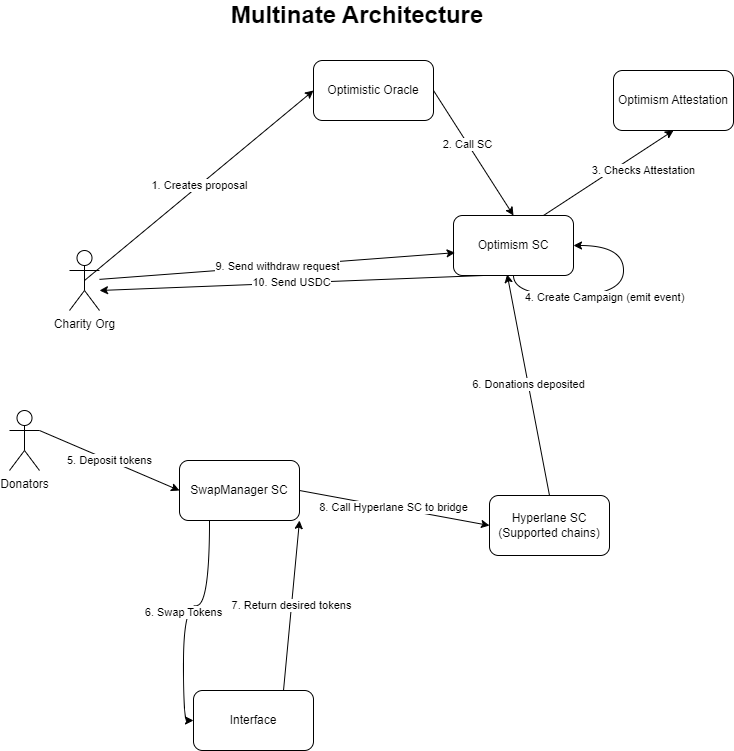

# Multinate - Cross-chain Donation Aggregator

Multinate is a web-based application that enables charity organizations to create fundraising events and accept donations from various supported blockchains. The platform utilizes **Snapshot** to create a proposal for fundraising, which is then executed via a **Safe** with validation by **UMA**. The execution of the smart contract function is verified by **Optimism's attestation contract**, which ensures that the charity organizations meet a certain level of credibility before being allowed to raise funds.

## Features

- Support for multiple blockchains:
  Gnosis Testnet
  Optimism Testnet
  Scroll Alpha Testnet
  Goerli Testnet
  Mumbai Testnet
- Secure fundraising proposals via Snapshot
- Validation of proposals via Optimism's attestation contract
- Verification of charity organization's credibility
- Hyperlane interchain messaging APIs and SDKs
- Easy public verification for donors

# Starting a Fundraising Campaign

## How it works

The process involves a two-step verification process for the legitimacy of a charity organization. The first step is an off-chain verification process, while the second step is on-chain.

### Off-chain verification

The charity organization must provide necessary documentation to prove their legitimacy, such as registration documents from the relevant government authority, tax-exempt status proof (if applicable), financial statements and annual reports, details of past and ongoing projects, and the organization's mission and vision statement.

### Attestation process

After collecting the necessary documentation, a trusted third-party (TTP) will review the provided information and attest to the legitimacy of the organization. The TTP should have a verified identity on the Optimism network and be a reputable entity (e.g., a legal or accounting firm, government authority, or another well-established charity organization).

The TTP will review the documentation, conduct additional background checks as necessary, and attest to the organization's legitimacy by signing a message with their private key.

### On-chain attestation contract

A smart contract will be deployed on the Optimism network to interact with Optimism's AttestationStation contract for the exact attestation process. The contract will also include functions to register TTPs and their public keys, store attestations from TTPs, along with the charity organization's address and the amount they want to raise, verify TTP signatures to ensure the attestations are genuine, and set eligibility criteria for the amount organizations can raise based on their attestation status.

### Eligibility determination

Based on the attestation results stored in the smart contract, the contract will determine if a charity organization is eligible to raise the specified amount. This can be done by comparing the attestation status and the amount they want to raise with predefined eligibility criteria.

### Public verification

The attestation contract should provide a function for anyone to query the legitimacy of a charity organization based on their Ethereum address. This will make it easy for donors to verify if an organization has gone through the attestation process and if they meet the criteria for raising the desired amount.

# Donations and Withdrawals

## How it works

After the campaign is created, users are able to donate tokens from one of our above supported chains. The tokens supported will be determined based on liquidity at the point of time.

### Swapping of tokens

A feature of Multinate is that it will automatically convert any tokens donated by a user to the stablecoin that the charity organisation requires (in this case, USDC). It will interface with a decentralised exchange to perform the swaps.

### Bridging through Hyperlane

After the tokens are swapped to the desired stablecoin, the tokens will be sent to the destination chain (Optimism), powered by Hyperlane where it will be stored in the holding contract to await withdrawal.

### Architecture

## Technologies

Multinate utilizes several technologies to achieve its functionality, including:

- [Snapshot Multinate](https://demo.snapshot.org/#/multinate.eth)
- [oSnap](https://github.com/gnosis/oSnap)
- [UMA](https://umaproject.org/)
- [Optimism's attestation contract](https://community.optimism.io/docs/governance/attestation-station/)
- [Hyperlane interchain messaging APIs and SDKs](https://www.hyperlane.co/)

## Getting started

To get started with Multinate, please visit our Snapshot link above and start a proposal.

## Conclusion

Multinate is an innovative platform that allows charity organizations to easily create fundraising events and accept donations from various supported blockchains. By utilizing technologies such as Snapshot, oSnap, UMA, Optimism's attestation contract, and Hyperlane interchain messaging APIs and SDKs, we can ensure that donations are secure and that charity organizations meet the required standards to raise the specified amounts for their projects.

At Multinate, we are committed to creating a transparent and efficient platform for charity fundraising. Our platform ensures that donations are secure and that charity organizations meet the required standards to raise the specified amounts for their projects.
